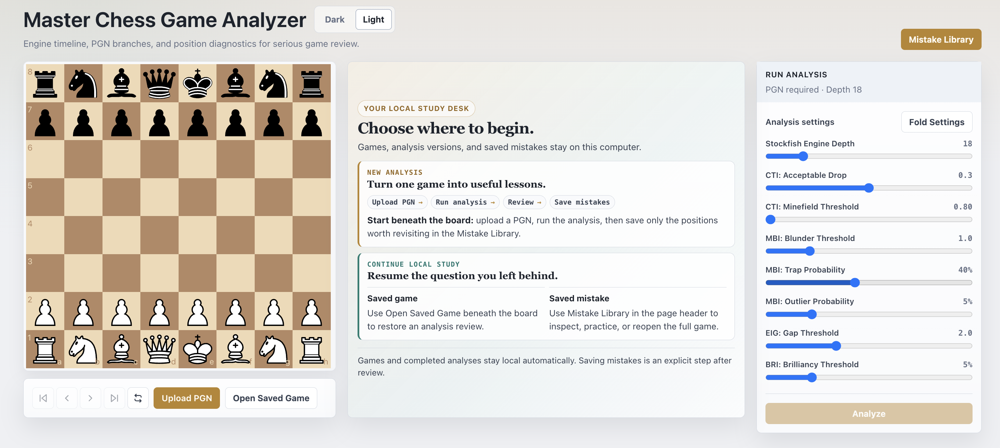
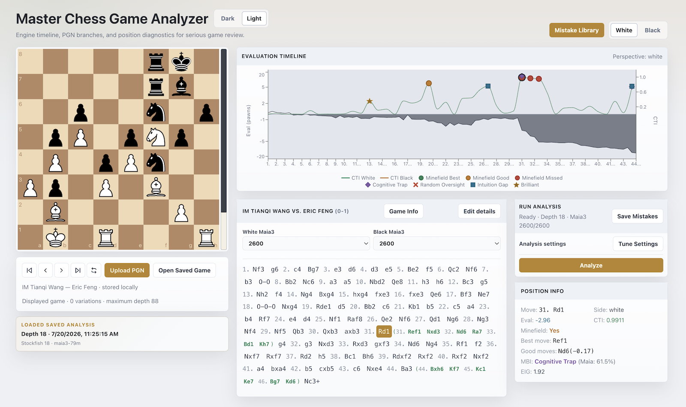
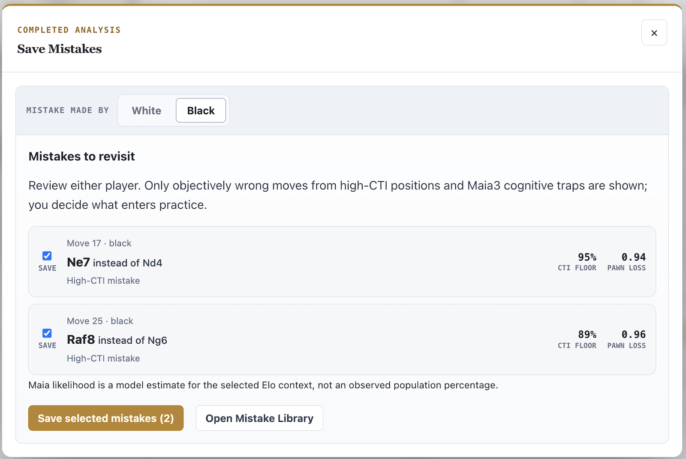
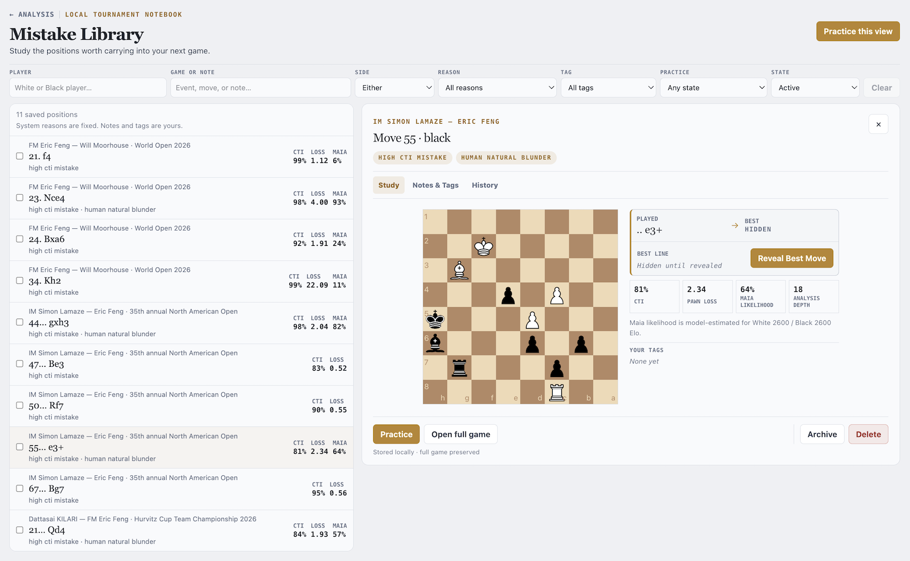

# Master Chess Game Analyzer User Guide

This guide explains how to analyze a PGN, understand the results and configuration, save mistakes worth revisiting, and continue local study. Games, analyses, saved mistakes, tags, and practice attempts stay on your machine.

## Choose Your Workflow

### New analysis

**Upload PGN** → **Configure analysis** → **Run analysis** → **Review results** → **Save selected mistakes** → **Mistake Library** → **Practice**

Use **Upload PGN** beneath the board to begin. A game and its completed analyses are retained locally; saving suggested mistakes is a separate, explicit action after review.

### Continue local study

- Use **Open Saved Game** beneath the board to reopen a stored game and resume analysis review.
- Use **Mistake Library** in the page header to inspect, practice, or open the full game for a saved mistake.

## Understand the Analysis Metrics

Read this section before changing the default configuration. The values below explain what the sliders control and how the application interprets an analyzed position.

### CTI (Critical Tension Index)

**Range**: 0.0 to 1.0

CTI measures how hard it is for a human to find a good move. It works by asking: "What fraction of the move probability mass (according to Maia) falls on objectively good moves (according to Stockfish)?"

- **CTI = 0.0**: All moves that Maia considers likely are objectively good. Easy position.
- **CTI = 0.85**: 85% of the probability mass falls on moves that are not within the acceptable drop of the best move. Very difficult for humans.
- **CTI = 1.0**: No move that humans are likely to play is objectively acceptable. Extremely hard.

CTI applies to any position regardless of evaluation. A position can be +5.0 in White's favor and still have high CTI if the winning moves are hard to find.

For new analyses, a move is considered objectively good when it is within the **CTI: Acceptable Drop** of the best move. This setting defaults to **0.3 pawns** and supports values from **0.2 to 0.4 pawns**.

For performance, CTI evaluates Stockfish roots covering at least 99% of Maia3's move probability and reports the unevaluated tail as an uncertainty interval of at most one percentage point. Approximate values use an `≈` marker; positions near the minefield threshold are refined until their classification is unambiguous.

**Chart display**: Green line (White's moves), orange line (Black's moves).

### Minefield

**Type**: Binary flag (Yes/No)

A position is flagged as a minefield when its CTI exceeds the **CTI: Minefield Threshold**. This setting defaults to **0.80** and supports values from **0.80 to 0.95**. Minefields represent dangerous positions where a strong player is likely to go wrong.

**Chart display**: Colored circles on the CTI line:

- Green circle: Player found the best move in a minefield
- Orange circle: Player found a good (but not best) move
- Red circle: Player missed all good moves

### MBI (Master Blunder Index)

**Type**: Classification (or `null` if not a blunder)

When a move loses more than the blunder threshold in eval, MBI classifies the blunder into one of three categories using Maia's prediction:

- **Cognitive Trap** (diamond marker): Maia probability > trap threshold. The bad move "looks natural" — even a neural network trained on human games would play it. These are the most instructive blunders for post-game review.
- **Random Oversight** (X marker): Maia probability < outlier threshold. The bad move is unexpected even for humans — a mouse slip or momentary lapse.
- **Unclassified Blunder** (outline diamond): Maia probability falls between the two thresholds.

**Chart display**: Fuchsia diamonds (cognitive traps), red X marks (random oversights), fuchsia outline diamonds (unclassified).

### EIG (Engine-Intuition Gap)

**Range**: 0.0+ pawns

EIG measures the eval difference between Stockfish's best move and Maia's most probable move. A high EIG means the engine strongly disagrees with human intuition.

- **EIG = 0.0**: Engine and humans agree on the best move
- **EIG = 2.5 (Flagged)**: Engine's best move is 2.5 pawns better than what humans would naturally play

Positions with high EIG are where engine-assisted analysis can reveal the biggest practical opportunities.

**Chart display**: Cyan squares when EIG exceeds the threshold.

### BRI (Brilliancy)

**Type**: Boolean flag

A move is flagged as brilliant when it is the engine's best move and has a very low Maia probability (below the brilliancy threshold). These are objectively strong moves that humans almost never find.

**Chart display**: Gold stars.

### Best Line

The Stockfish principal variation (up to 6 half-moves) showing the recommended continuation. Displayed in the PGN viewer as inline variations for positions where the played move was a blunder.

### Mate Detection

When a forced checkmate exists, the position info shows `#N` (White mates in N) or `#-N` (Black mates in N) instead of a numeric eval.

## Configure Analysis

The **Analysis Configuration** panel displays 8 configurable sliders. Leave the defaults in place until you are comfortable with the metric definitions above.

The game information area also provides separate **White Maia3** and **Black Maia3** Elo controls. Both default to `2600` for new and unanalyzed games; select the ratings that best represent each player before starting analysis. Reopening an analyzed game restores the ratings that were actually used for that saved run.

- **Stockfish Engine Depth** (16-28, default 18): Higher depth = more accurate but slower analysis
- **CTI: Acceptable Drop** (0.2-0.4, default 0.3): Maximum eval drop (in pawns) for a move to count as "good" in CTI computation
- **CTI: Minefield Threshold** (0.80-0.95, default 0.80): CTI value above which a position is flagged as a minefield
- **MBI: Blunder Threshold** (0.5-3.0, default 1.0): Minimum eval drop (in pawns) to classify a move as a blunder
- **MBI: Trap Probability** (10%-80%, default 40%): Maia probability above which a blunder is a "Cognitive Trap"
- **MBI: Outlier Probability** (1%-20%, default 5%): Maia probability below which a blunder is a "Random Oversight"
- **EIG: Gap Threshold** (0.5-5.0, default 2.0): Minimum eval difference (in pawns) to flag an Engine-Intuition Gap
- **BRI: Brilliancy Threshold** (1%-20%, default 5%): Maximum Maia probability for a best move to qualify as "Brilliant"

### Configuration Reference

| Parameter | Default | Range | Description |
|---|---|---|---|
| Stockfish Engine Depth | 18 | 16-28 | Search depth for Stockfish analysis |
| CTI: Acceptable Drop | 0.3 | 0.2-0.4 | Max eval drop (pawns) for a move to be "good" |
| CTI: Minefield Threshold | 0.80 | 0.80-0.95 | CTI above this flags a minefield |
| MBI: Blunder Threshold | 1.0 | 0.5-3.0 | Min eval drop (pawns) to classify a move as a blunder |
| MBI: Trap Probability | 40% | 10%-80% | Maia probability above which a blunder is a Cognitive Trap |
| MBI: Outlier Probability | 5% | 1%-20% | Maia probability below which a blunder is a Random Oversight |
| EIG: Gap Threshold | 2.0 | 0.5-5.0 | Min eval gap (pawns) to flag an Engine-Intuition Gap |
| BRI: Brilliancy Threshold | 5% | 1%-20% | Max Maia probability for best move to be "Brilliant" |
| White Maia3 Elo | 2600 | 2000, 2200, 2400, 2600 | White player's rating context for Maia3 |
| Black Maia3 Elo | 2600 | 2000, 2200, 2400, 2600 | Black player's rating context for Maia3 |

## Workflow: Analyze a New Game

### 1. Upload a PGN File

Click **Upload PGN** next to the move navigator below the chess board. A `.pgn` file may contain one game or a sequence of games. The application validates the complete file first, saves every unique game to the local database in one atomic batch, and displays the first game's mainline in the analyzer. The first game is ready for analysis but is not analyzed automatically; the remaining games stay in the Local Game Library as **Not analyzed** until you open and analyze them. If any game is invalid, the complete import is rejected and none of its games are saved.

After import, an inline message beneath the board reports how many entries were loaded, how many unique games were added or already saved, and how many duplicate entries were skipped. Successful messages disappear after eight seconds. The displayed game's variation count and maximum depth always refer to the first game, not the complete batch.

Games are recognized from chess content, not filenames or PGN decoration. Headers, result text, whitespace, comments, annotations, clocks, and side variations do not create a new game. Importing an equivalent PGN therefore reopens the existing local game and restores its newest saved analysis and settings without running Stockfish or Maia.

### 2. Run Analysis

Click **Analyze** to start. A progress bar shows positions analyzed and minefields found. Analysis can be canceled at any time.

Completed analyses are saved as immutable versions of the game. Clicking **Analyze** with the same completed configuration restores that version without engine work. Changing depth, thresholds, Elo context, or another result-affecting setting creates a new version. The **Analysis history** control identifies versions by date and depth and can restore any of them instantly.

### 3. Navigate Results

After analysis completes:

- **Chart**: Click any point on the evaluation chart to jump to that move. Use the **White Player** / **Black Player** toggle above the chart to filter CTI lines and markers by perspective.
- **Move Navigator**: Use the arrow buttons below the board to step through moves.
- **PGN Viewer**: Click any move in the PGN notation to navigate there. Stockfish best continuations for blunders appear inline in bold green parenthesized notation `(...)`. User-explored variations appear in teal bracket notation `[...]`.
- **Chess Board**: Updates automatically to show the position for the selected move. After analysis, a thin vertical evaluation bar beside the main board visualizes that exact position's White-versus-Black balance. Hover over the bar to reveal only its compact White-perspective value: signed pawn scores such as `+1.25` or `-2.50`, signed mate values such as `#3` or `#-2`, and terminal results `1-0` or `0-1`. Explored and Stockfish-variation positions use a neutral striped bar with a `pending` tooltip while their ad-hoc evaluation runs, never a stale mainline value. The segment order flips with the board without changing the score's perspective. Click the flip button to change board orientation. After analysis, drag or click pieces to explore alternative moves.
- **Position Info**: Shows detailed metrics for the selected move including eval, CTI, minefield status, MBI classification, EIG, and BRI.

### 4. Explore Alternative Moves

After analysis completes, the board becomes interactive. You can test "what if" lines:

- **Drag a piece** or **click a piece then click its target** to play an alternative move. If the move matches the mainline, navigation advances normally. If it differs, exploration mode begins.
- **Exploration mode**: A teal "Explored" badge appears in Position Info. Each explored move is evaluated by Stockfish at the configured analysis depth, showing eval, best move, and good moves. CTI is shown only for mainline analyzed positions. Continue playing moves to explore deeper.
- **Multiple lines**: Explored lines are saved when you exit or start a new exploration. The PGN viewer shows all saved explorations grouped by branch point. Lines sharing a common prefix are merged into a single block.
- **Stockfish variation details**: The six-half-move principal variation is available immediately after batch analysis. Click a move in a Stockfish best-line variation `(...)` to load its evaluation details (eval, best move, good moves) at depth 10. The board navigates immediately while the detail panel shows a pending state. Results are cached for the current analysis session, failed requests can be retried, and older saved analyses with precomputed details continue to use those values without engine work.
- **Arrow keys**: Left/Right arrow keys navigate within the active exploration or variation. At the first move, Left exits back to the mainline.
- **Exit**: Press **Escape**, click any mainline move, or click the chart to exit exploration/variation mode.
- **Game Info**: Click "Show game info" above the PGN viewer to display PGN metadata (Event, Site, Date, players, Elo, ECO, etc.). The panel auto-hides when you click anywhere else on the page.

### 5. Save Mistakes Worth Revisiting

After analysis completes, the **Mistakes to revisit** panel reads the persisted result for the selected White or Black side. It suggests only the union of:

- **High-CTI mistake** — the played move lost at least the configured acceptable drop and the CTI lower bound met the configured minefield threshold.
- **Human-natural blunder** — MBI classified the objective blunder as a cognitive trap because Maia3 assigned the played move at least the configured trap probability in the selected Elo context.

A high-CTI position is not saved when the player found an acceptable move. One position matching both reasons appears once with both system labels. Approximate CTI uses its lower bound, so an uncertainty interval that crosses the threshold is not promoted as a definite minefield.

Choose **White** or **Black** under **Mistake made by**. Either side can represent you or your opponent; no player profile is required. Review the compact suggestions and select **Save selected mistakes**. Saving is explicit and duplicate-safe. The completed game analysis and full normalized PGN are already stored locally even when no suggestion is saved.

Re-analysis shows only additional mistakes. Active and archived Mistake Library items both suppress the same saved decision from later capture suggestions. Existing notes, tags, evidence, lifecycle, and practice attempts are never overwritten by re-analysis; deleting an item allows that decision to be suggested again.

Maia likelihood is a model-estimated probability that a player in the selected White/Black Elo context would choose the move. It is not an observed percentage of real players.

## Workflow: Continue Local Study

### Open a Saved Game

Every unique game in a valid PGN file is saved locally as soon as the complete batch passes validation. Repeated entries in the same file and games already present in the library are deduplicated by chess content, so they do not create extra logical games or analysis runs. **Open Saved Game** opens a searchable, filterable library as an overlay in the current analyzer workspace: choose All, Analyzed, or Not analyzed games, sort by recently opened, recently added, or players, preview a row, then explicitly open it. Opening an analyzed game restores its preferred saved result and history without starting the engines; opening an unanalyzed game, including a trailing game from a multi-game import, restores its PGN and clears the prior analysis state so it is ready to analyze.

The library labels games from effective Tournament/Event, White, and Black values. A manual value takes precedence over a retained usable imported PGN value, which in turn takes precedence over a missing value. Uploading an equivalent PGN can fill a previously missing imported value, but never overwrites a manual correction. Use **Edit details** from Game Info or the library preview to correct these fields; clearing a manual value falls back to the imported value. Raw PGN and analysis-run headers remain unchanged as provenance.

Game identity is based on chess content rather than PGN headers or a file name. Thus two files with identical moves are one local game even if their event or player details differ. This makes repeat imports and saved-analysis restoration reliable, but it cannot distinguish separately played games with exactly the same move sequence.

### Use the Local Mistake Library

Open **Mistake Library** from the analyzer header. The library is a game-oriented tournament notebook rather than a profile or diagnosis dashboard:

- Filter explicitly by player name across the White and Black PGN headers, while searching event, played move, and note text separately.
- Filter by the player who made the mistake, `High-CTI mistake`, `Human-natural blunder`, one of your tags, archive state, or last practice result. Filters can be combined.
- Inspect the original decision board, played move, best and acceptable moves, objective loss, CTI interval, Maia likelihood/Elo context, analysis depth, and stored best line.
- Add your own note and multiple case-insensitive tags. Remove tags as chips, choose suggested tags, or enter custom ones. Suggested tags include Candidate generation, Calculation horizon, Opponent resource, Resulting-position evaluation, Strategic plan, Opening memory, Defensive resource, Time management, and Execution. These are optional player labels; the application never asserts them as the cause.
- Archive, restore, or delete a saved mistake without deleting its game.
- Choose **Open full game** to restore the stored PGN, complete result timeline, analysis settings, and saved position without uploading or analyzing again.

System capture reasons are immutable. Notes and tags are player-owned. Lists are paginated and read only stored SQLite data; browsing does not run Stockfish or Maia.

### Practice Saved Mistakes

Start practice from the current filtered view, an explicit selection, or one mistake. Filtering by a tag and choosing **Practice this view** creates a bounded tag-focused practice queue.

1. **Think** — The board opens at the original decision position from the saved side. The played mistake, best move, CTI/MBI verdict, objective loss, and continuation remain hidden. Play a legal move on the board, enter SAN, or explicitly Reveal without a move.
2. **Reveal** — Compare your move with the played mistake, best and acceptable moves, objective loss, CTI interval, Maia played-move likelihood/Elo context, and stored best line.
3. Choose **Again** or **Understood**. The application stores the submitted move, objective acceptability, outcome, and date.

There are no points, streaks, hints, four-grade scheduling, leeches, inferred weaknesses, or engagement rewards. The library can filter `Again` positions when you want another pass.

Practice shortcuts:

| Key | Action |
|---|---|
| `R` | Reveal the current position |
| `1` | Again |
| `2` | Understood |
| `Escape` | Return to the Mistake Library |

## Local Data, Storage, and Privacy

Games, analyses, saved mistakes, tags, and practice attempts use `backend/data/master-chess-analysis.db` by default. Existing databases are upgraded automatically while preserving existing study data. Long-running analysis continues in the background; progress can resume when the same game and settings are reopened after a browser or backend reconnect.

If persistence is unavailable, the first game in a valid PGN can still be viewed and analyzed in memory. Trailing games are not retained. The UI keeps a non-expiring warning visible and does not claim that the import or result was saved; cache history remains unavailable until local persistence recovers.

Deleting a saved mistake removes only that mistake's tag links and minimal attempt history. The complete analysis run and PGN remain. Back up the SQLite file while the backend is stopped if it contains valuable study data.

Everything stays on the local machine. There is no account, cloud synchronization, sharing, coach surveillance, opponent profile, leaderboard, LLM coaching, or live-game feature.
